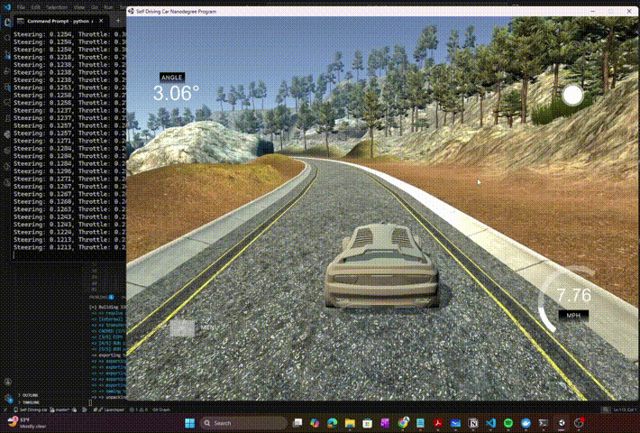

# 🚗 Self-Driving Car with PyTorch and Flask

A self-driving car simulation using behavioral cloning with PyTorch. The system receives images from the **Udacity Self-Driving Car Simulator**, predicts steering angles in real time, and controls the vehicle via a Flask + SocketIO backend server. The model is based on **NVIDIA's end-to-end CNN architecture (PilotNet)** for autonomous driving.

---

## DEMO


---

## 📐 Model Architecture (PilotNet)

Input: **66×200 RGB image** → Output: **Steering angle (continuous value)**

### Convolutional Backbone

| Layer | Filters | Kernel | Stride | Output Shape | Activation |
|---|---|---|---|---|---|
| Conv2D | 24 | 5×5 | 2 | 31×98×24 | ELU |
| Conv2D | 36 | 5×5 | 2 | 14×47×36 | ELU |
| Conv2D | 48 | 5×5 | 2 | 5×22×48 | ELU |
| Conv2D | 64 | 3×3 | 1 | 3×20×64 | ELU |
| Conv2D | 64 | 3×3 | 1 | 1×18×64 | ELU |

### Fully Connected Head

| Layer | Neurons | Activation | Regularization |
|---|---|---|---|
| Flatten | 1152 | — | — |
| Linear | 100 | ELU | Dropout (0.5) |
| Linear | 50 | ELU | Dropout (0.5) |
| Linear | 10 | ELU | — |
| Linear | 1 | Linear (output) | — |

**Activation:** ELU (Exponential Linear Unit) for faster convergence and better gradient flow.  
**Regularization:** Dropout (p=0.5) on the first two fully connected layers to prevent overfitting.

```python
class PilotNet(nn.Module):

    def __init__(self):
        super(PilotNet, self).__init__()

        self.conv = nn.Sequential(
            nn.Conv2d(3, 24, kernel_size=5, stride=2), nn.ELU(),
            nn.Conv2d(24, 36, kernel_size=5, stride=2), nn.ELU(),
            nn.Conv2d(36, 48, kernel_size=5, stride=2), nn.ELU(),
            nn.Conv2d(48, 64, kernel_size=3),           nn.ELU(),
            nn.Conv2d(64, 64, kernel_size=3),           nn.ELU()
        )

        self.fc = nn.Sequential(
            nn.Flatten(),
            nn.Linear(64 * 1 * 18, 100), nn.ELU(), nn.Dropout(0.5),
            nn.Linear(100, 50),          nn.ELU(), nn.Dropout(0.5),
            nn.Linear(50, 10),           nn.ELU(),
            nn.Linear(10, 1)
        )

    def forward(self, x):
        x = self.conv(x)
        x = self.fc(x)
        return x
```

---

## 🖼️ Image Preprocessing

Each frame is preprocessed before being passed to the network:

```python
img = img[60:135, :, :]                        # Crop sky and hood
img = cv2.cvtColor(img, cv2.COLOR_RGB2YUV)     # RGB → YUV
img = cv2.GaussianBlur(img, (3, 3), 0)         # Reduce noise
img = cv2.resize(img, (200, 66))               # Resize to NVIDIA input dims
img = img / 255.0                              # Normalize to [0, 1]
img = np.transpose(img, (2, 0, 1))            # HWC → CHW for PyTorch
```

---

## 🎨 Data Augmentation

A rich augmentation pipeline is applied during training to improve generalization across varied driving conditions. Each augmentation is visualized below alongside the original frame and its effect on the steering angle.

| Augmentation | Description | Affects Steering? |
|---|---|---|
| **Pan** | Random horizontal/vertical translation | ✅ Yes |
| **Zoom** | Random crop and resize | ❌ No |
| **Brightness** | Random brightness shift in HSV space | ❌ No |
| **Contrast** | Random contrast scaling | ❌ No |
| **Shadow** | Synthetic random shadow overlay | ❌ No |
| **Edges** | Edge enhancement via Laplacian | ❌ No |
| **Noise** | Gaussian noise injection | ❌ No |
| **Flip** | Horizontal mirror + negated steering | ✅ Yes |

The `random_augment` function randomly composes a subset of these transforms at training time to produce diverse training samples.

---

## 📊 Training

| Setting | Value |
|---|---|
| Loss Function | Mean Squared Error (MSE) |
| Optimizer | Adam (lr = 1e-3) |
| LR Scheduler | ReduceLROnPlateau (monitors val loss) |
| Gradient Clipping | Max norm = 1.0 |
| Batch Size | 100 |
| Epochs | 10 |
| Train / Val / Test Split | 80% / 10% / 10% |
| Best Model Checkpoint | Saved when val loss improves (`best_model.pth`) |

### Training Loop

The loop includes a full train/validation cycle per epoch, gradient clipping for stability, learning rate scheduling based on validation loss, and automatic checkpointing of the best model:

```python
for epoch in range(epochs):

    # Training phase
    model.train()
    for images, steering in train_loader:
        images, steering = images.to(device), steering.to(device).unsqueeze(1)
        outputs = model(images)
        loss = criterion(outputs, steering)
        optimizer.zero_grad()
        loss.backward()
        torch.nn.utils.clip_grad_norm_(model.parameters(), 1.0)  # gradient clipping
        optimizer.step()

    # Validation phase
    model.eval()
    with torch.no_grad():
        for images, steering in valid_loader:
            images, steering = images.to(device), steering.to(device).unsqueeze(1)
            outputs = model(images)
            loss = criterion(outputs, steering)

    # Step scheduler & save best checkpoint
    scheduler.step(val_loss)
    if val_loss < best_val_loss:
        best_val_loss = val_loss
        torch.save(model.state_dict(), "best_model.pth")
```

**GPU required** — the training loop runs on `device = 'cuda'`.

---

## 🐳 Docker Setup

Docker ensures consistent deployment without dependency issues.

**Dockerfile:**
```dockerfile
FROM python:3.11-slim

WORKDIR /app
COPY . /app
RUN pip install --no-cache-dir --upgrade pip
RUN pip install --no-cache-dir -r requirements.txt

EXPOSE 4567
CMD ["python", "drive.py"]
```

**Build & Run:**
```bash
# Build
docker build -t selfdriving-car .

# Run
docker run --rm -p 4567:4567 selfdriving-car
```

> Port `4567` is mapped to the host for Udacity simulator communication.  
> For faster inference, add GPU support via [NVIDIA Docker](https://github.com/NVIDIA/nvidia-docker).

---

## 🖥️ Running the Project

### Prerequisites
- [Udacity Self-Driving Car Simulator](https://github.com/udacity/self-driving-car-sim) installed
- Docker (or Python + virtual environment)
- Trained model file: `best_model.pth`

### Option 1 — Docker
```bash
docker build -t selfdriving-car .
docker run --rm -p 4567:4567 selfdriving-car
```

### Option 2 — Local Python
```bash
conda activate carenv   # or your virtualenv
python drive.py
```

Then open the Udacity Simulator, select **Autonomous Mode**, and connect to `localhost:4567`.

---

## ⚙️ Flask + SocketIO Server

The server handles the full inference loop:

1. Receives telemetry (image + speed) from the simulator
2. Preprocesses the image
3. Runs inference with the PyTorch model
4. Computes throttle based on current speed
5. Sends steering angle and throttle back to the simulator

```python
@sio.on('telemetry')
def telemetry(sid, data):
    speed = float(data['speed'])
    image = Image.open(BytesIO(base64.b64decode(data['image'])))
    image = np.asarray(image)
    image = img_preprocess(image).to(device)

    with torch.no_grad():
        steering_angle = model(image).item()
    throttle = 1.0 - speed / speed_limit
    send_control(steering_angle, throttle)
```

---

## 💡 Tips

- Load `best_model.pth` (the checkpoint with the lowest validation loss) for inference — not the final epoch weights.
- Ensure your model architecture matches **exactly** between training and inference — otherwise `load_state_dict` will fail.
- Always call `model.eval()` before inference to disable Dropout layers.
- The Dropout layers (p=0.5) are active **only during training** — they are automatically disabled in eval mode.
- Improve accuracy further with:
  - Additional augmentation types (rotations, color jitter)
  - Deeper CNN backbone or skip connections
  - Learning rate warmup before ReduceLROnPlateau kicks in

---

## 📚 References

- [NVIDIA — End to End Learning for Self-Driving Cars](https://arxiv.org/abs/1604.07316)
- [Udacity Self-Driving Car Simulator](https://github.com/udacity/self-driving-car)
- [PyTorch Documentation](https://pytorch.org/docs/stable/index.html)
- [Flask-SocketIO Docs](https://flask-socketio.readthedocs.io/)
